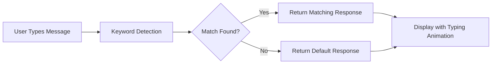

# 💬 Customer Support Chatbot


A modern, interactive customer support chat widget that simulates real-world helpdesk conversations. Built with vanilla HTML, CSS, and JavaScript.

---

## ✨ Features

| Feature                 | Description                                         |
| ----------------------- | --------------------------------------------------- |
| 🎨 **Dark Theme UI**    | Sleek, modern interface with smooth aesthetics      |
| 🤖 **Smart Responses**  | Keyword-based matching for intelligent replies      |
| 📦 **Order Tracking**   | Automatic order number detection and status updates |
| ⌨️ **Typing Indicator** | Animated dots simulate real typing                  |
| 🕐 **Timestamps**       | Real-time message timestamps                        |
| 📱 **Sidebar Panel**    | Quick links, FAQs, and contact info                 |

---

## � Screenshots

### Homepage

Chatbot Interface


### Chat in Action

Chat Demo


---

## �🚀 Quick Start

```bash
# Clone the repository
git clone https://github.com/yourusername/customer-support-chatbot.git

# Open in browser
open index.html
```

Or simply download and double-click `index.html`!

---

## 🧠 Bot Intelligence

The chatbot recognizes these keyword categories:

| Category         | Keywords                     | Example Response                                           |
| ---------------- | ---------------------------- | ---------------------------------------------------------- |
| 👋 **Greetings** | hello, hi, hey               | "Hi there! How can I assist you today?"                    |
| 📦 **Orders**    | order, track, status, cancel | "To check your order, please provide your order number..." |
| 🚚 **Shipping**  | shipping, delivery, express  | "We offer free shipping on orders over ₹1500..."           |
| 💰 **Refunds**   | refund, return, exchange     | "Refunds are processed within 5-7 business days..."        |
| 🏷️ **Products**  | price, discount, size        | "Use code SAVE10 for 10% off!"                             |
| 💳 **Payment**   | payment, account, password   | "We accept Visa, debit, credit, and UPI..."                |
| 🆘 **Support**   | help, problem, issue         | "I can help with orders, shipping, refunds..."             |

> 💡 **Pro Tip:** Enter any order number (like `12345`) and the bot will automatically recognize it!

---

## 📁 Project Structure

```
📦 JavaScript/
├── 📄 index.html     → Main HTML structure
├── 🎨 style.css      → Dark theme styling
├── ⚙️ script.js      → Chatbot logic & responses
└── 📖 README.md      → Documentation
```

---

## 🛠️ How It Works



1. **Input** → User types a message and hits Enter/Send
2. **Parse** → Message is converted to lowercase for matching
3. **Match** → Keywords are checked against the response database
4. **Delay** → Typing indicator shows for 1-2 seconds
5. **Display** → Bot response appears with timestamp

---

## 🎯 Key Concepts Demonstrated

- ✅ DOM Manipulation
- ✅ Event Listeners (click, keypress)
- ✅ String Matching & Parsing
- ✅ Async Delays with `setTimeout`
- ✅ Dynamic Element Creation
- ✅ CSS Flexbox Layouts
- ✅ Dark Theme Design

---

<p align="center">
  <i> A JavaScript learning project</i>
</p>
